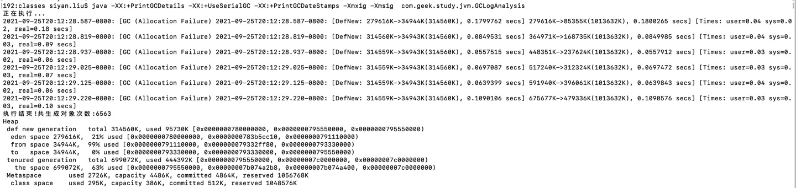

**一、SerialGC** 

     使用单线程GC时,堆内存大小设置成1g,从日志上来看,都是对年轻代进行的GC回收,没有触发full GC,也没有对老年代进行GC.
     
     根据最后的堆内存快照占用比例来看,新生代使用率为21%,from区占用率为99%,这说明长期存活的对象较多,此时还没有晋升到老年代,如果程序再继续运行下去的话,该区域的对象也很快就会被晋升到老年代中.
     
     观察ygc的时间,从55-179毫秒不等,这个STW时间相对较长,因为单线程GC,所以效率低,STW的时间也相对较长.
 
 

    将Xmx以及Xms缩小至512m,发现这次的minor GC不止有年轻代的GC 还有老年代的GC,此次依旧没有触发FullGC.
     
     根据堆内存快照日志分析,此次老年代空间使用率达到94%,分析也是因为老年代空间使用率太高,从而触发了频繁的老年代GC.
     
     观察minorGC的STW时间,此次的时间都在20毫秒以下,老年代GC的时间更短,猜测是因为堆内存空间小了,总体对象数量大幅度减小,所以标记未存活的的对象数量相对也减少了,用来标记和清理的时间就会大幅度缩减.
 
 
 
  
  
      最后,将Xmx,Xms内存减小至256M,出现了大量的Full GC.从日志上来看,一开始进行了几次年轻代的GC,后来有两次GC发生在老年代,但是从老年代清理前后的内存使用情况来看,清理后的内存不仅没有减少,反而还增加了,猜测可能是因为年轻代中有大量的对象晋升到老年代,而老年代的内存也不够用了,之后不得不开始FullGC,勉强维持避免发生OOM.
       
      观察最后堆内存快照情况,可以看到新生代内存是100%,老年代达到99%,可以发现发生OOM只是时间的问题了.
  
  
  
 **二、Parallel Scavenge**
 
 
 
 
    当前环境为jdk8,使用默认的GC,为年轻代Parallel Scavenge,老年代Serial Old回收策略. 此次分配内存为1g,未看到有FullGC的情况,但是老年代的使用比例也已经较高了
 
 
 
    将堆内存大小调整为512M,出现了多次FullGC的情况
 
 
 
 **三、CMS**
 
 
 
 
     使用CMS GC收集器,采用ParNew+CMS+Serial Old组合的方式回收对象.在此次试验中,可以看到完整的CMS流程,初始标记和最终标记虽然是STW的,但是暂停的时间非常短,甚至可以忽略不计,这个收集器比较适合对相应速度有要求的业务系统.
     
     之后又修改了对内存大小为512m,实验结果与预期一致,相对1G触发了多次CMS.