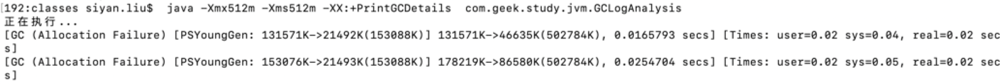
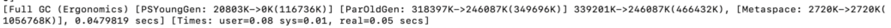
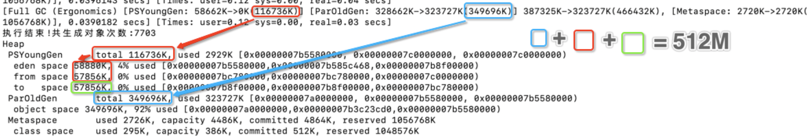
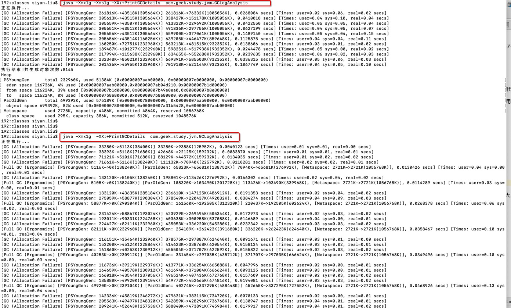
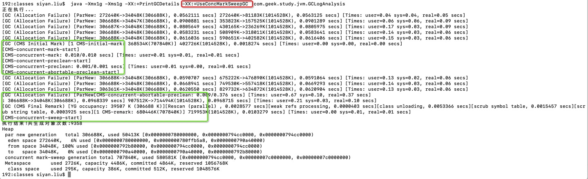
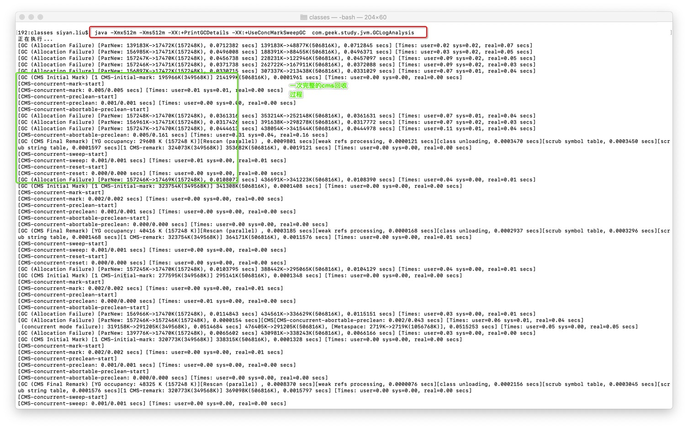

**GC日志分析**

执行 `java -Xmx512m -Xms512m -XX:+PrintGCDetails  com.geek.study.jvm.GCLogAnalysis`

分析：

`GC (Allocation Failure)`:代表触发了GC回收，原因是分配年轻代内存空间失败

`PSYoungGen: 131571K->21492K(153088K) `：代表触发了年轻代垃圾回收，占用空间从131M清理后为21M

`131571K->46635K(502784K),`：堆内存使用空间从131M压缩到46M 注意，这里垃圾清理前的使用内存和年轻代使用内存一致，代表这时还没有老年代数据存放.但总内存清理后，总使用空间比年轻代使用空间多了25M，代表这时老年代有25M的空间在这次回收后被占用

`0.0165793 secs`: GC用时 (STW用时)

`[Full GC (Ergonomics)`:触发了FullGc

`[ParOldGen: 309895K->280350K(349696K)]`：老年代回收

**设置Xmx大小但不设置Xms的大小 执行情况对比**

结果：加上xms参数指定大小与xmx相等时， fullGC的次数比不指定xms的次数要少，
因为不指定xms值时，一开始的内存没有那么大，当old区满了之后，触发fullGC，内存容量才会变大，直到变得和xmx一样大小。

**使用串行GC回收**

[DefNew]:串行的垃圾回收

**使用Conc垃圾回收**

[ParNew]: 并行的垃圾回收

